# Motel Reservation - Flutter Web App

A complete **Flutter Web** application for motel reservation with Firebase integration.

## 🚀 Features

- 🔐 Firebase Authentication
- 📊 Firebase Analytics
- 🌐 Web-optimized UI
- ⚡ Blazing fast performance

## 📋 Prerequisites

- Flutter SDK 3.0+
- Node.js 14+
- Git
- VS Code (recommended)

## 🛠️ Setup Guide

### ✅ Step 1: Clone the Project

```sh
git clone https://github.com/smsdahanayaka/motel_reservation.git

```

### ✅ Step 2: Install Flutter SDK

- Download and extract Flutter
- Add Flutter to your PATH
- Verify installation

```sh
flutter doctor
```

### ✅ Step 3: Install VS Code Extensions

- Required extensions:
- Flutter (by Dart Code)
- Dart (by Dart Code)

### ✅ Step 4: Firebase Setup

- Create project in Firebase Console
- Enable Email/Password Auth
- Optional: Enable Analytics

### ✅ Step 5: Install Tools

```sh
npm install -g firebase-tools
firebase login
dart pub global activate flutterfire_cli
```

### ✅ Step 6: Configure Firebase

```sh
rm lib/firebase_options.dart

flutterfire configure
flutter pub add firebase_core firebase_auth firebase_analytics
```

### ✅ Step 7: Run the App

```sh
flutter pub get
flutter run -d chrome
```

## 📂 Project Structure

```
motel_reservation/
├── lib/
│   ├── main.dart
│   ├── firebase_options.dart
│   ├── screens/
│   ├── widgets/
│   ├── services/
│   └── models/
├── web/
├── android/
├── ios/
└── test/
```

# Shan-M-Dahanayaka

<a href="https://www.linkedin.com/in/shan-m-dahanayaka/" target="_blank">Linkedin</a>


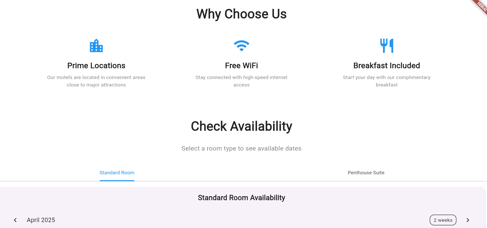

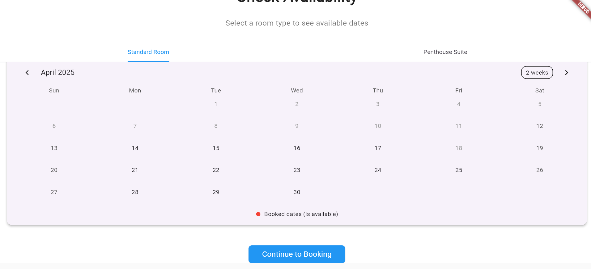

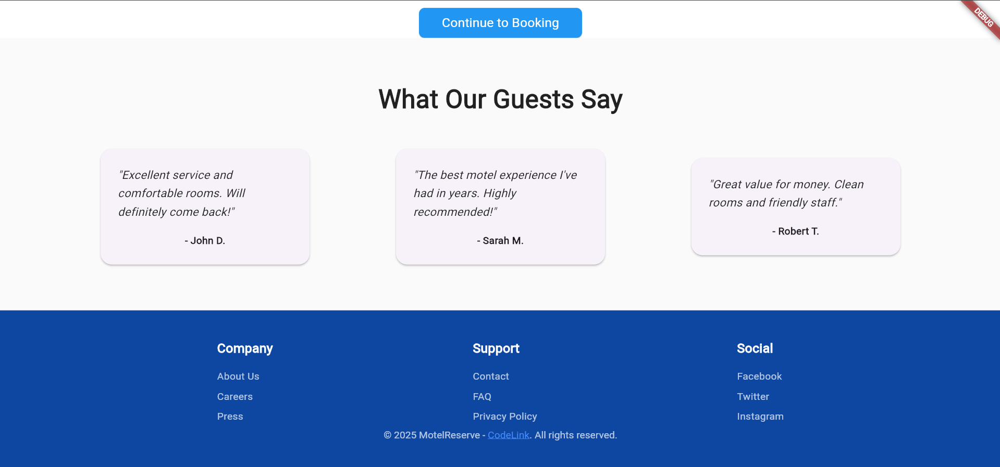

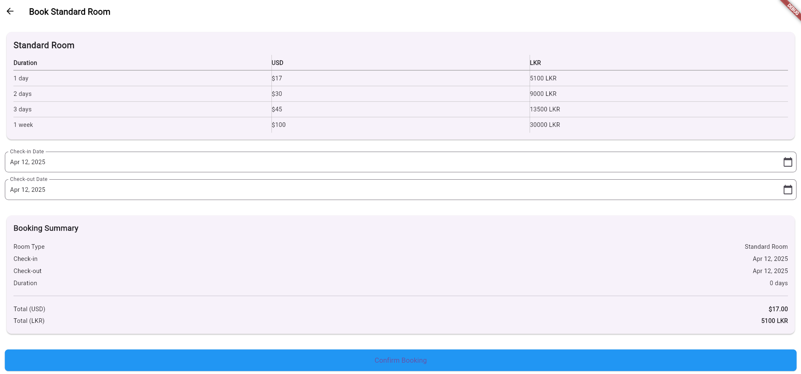

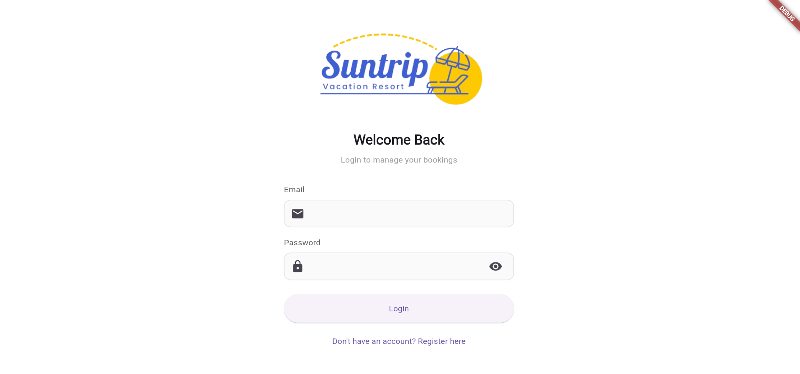

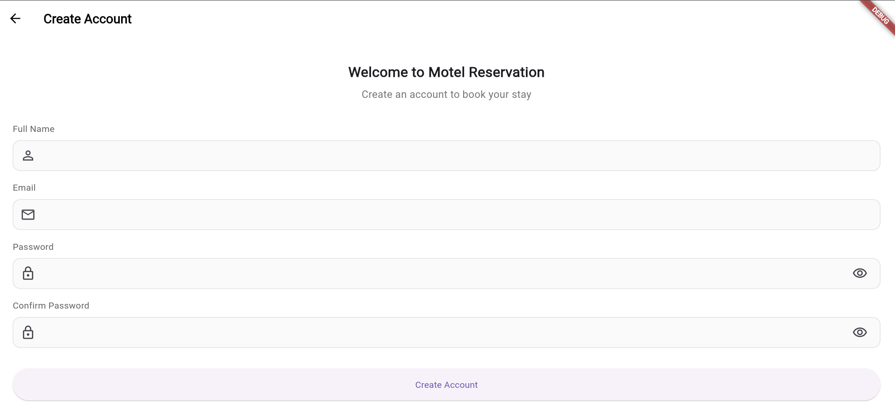

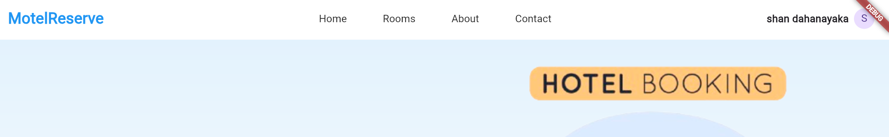

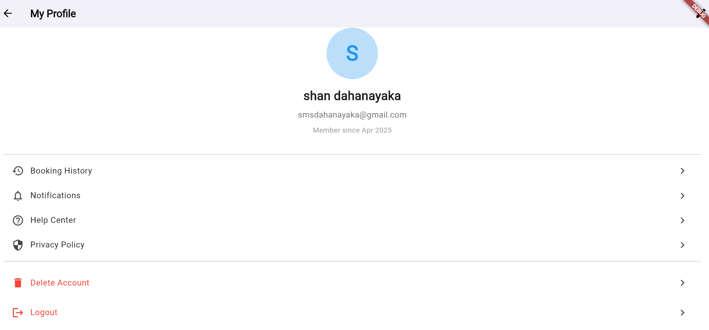

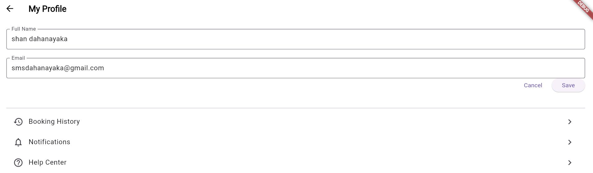

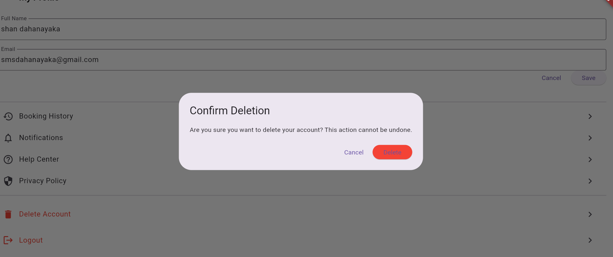

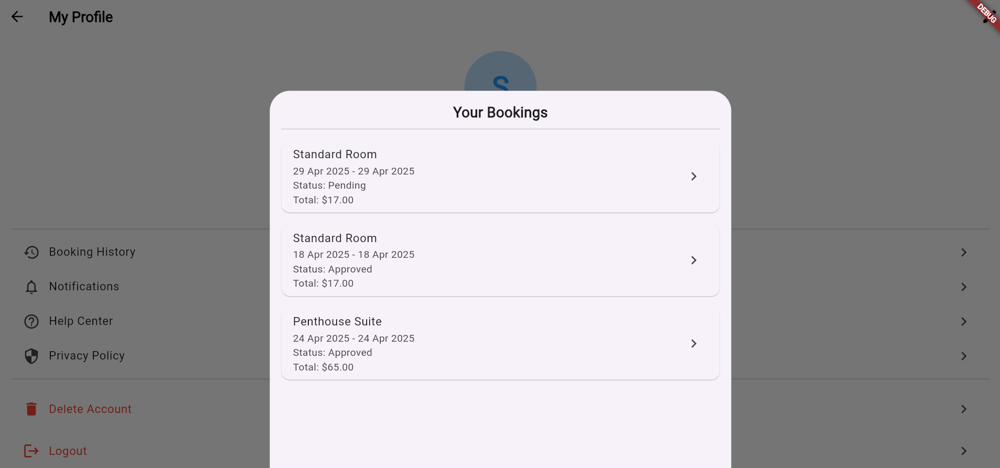

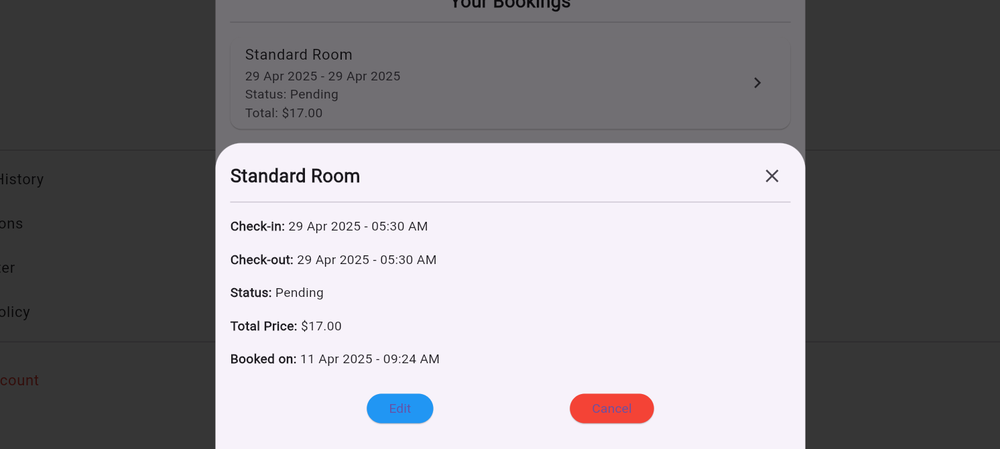

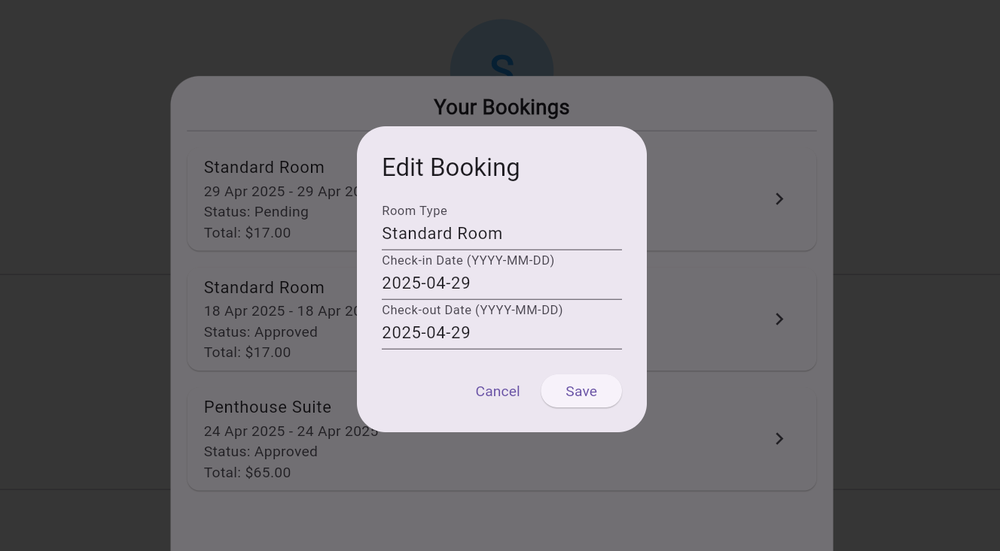

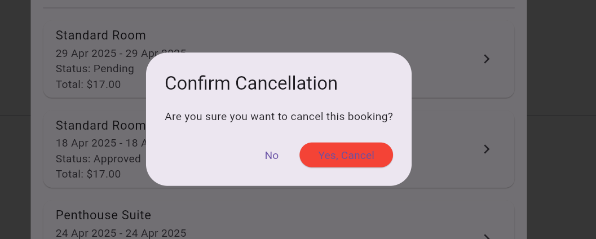